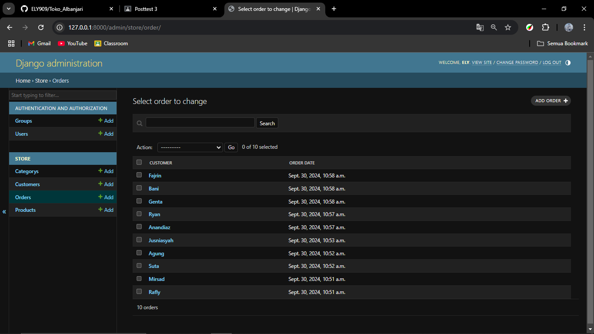
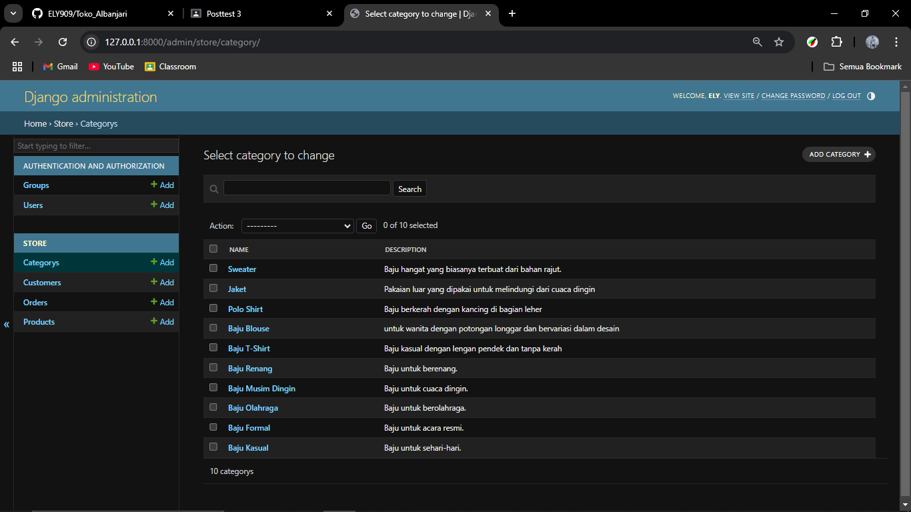
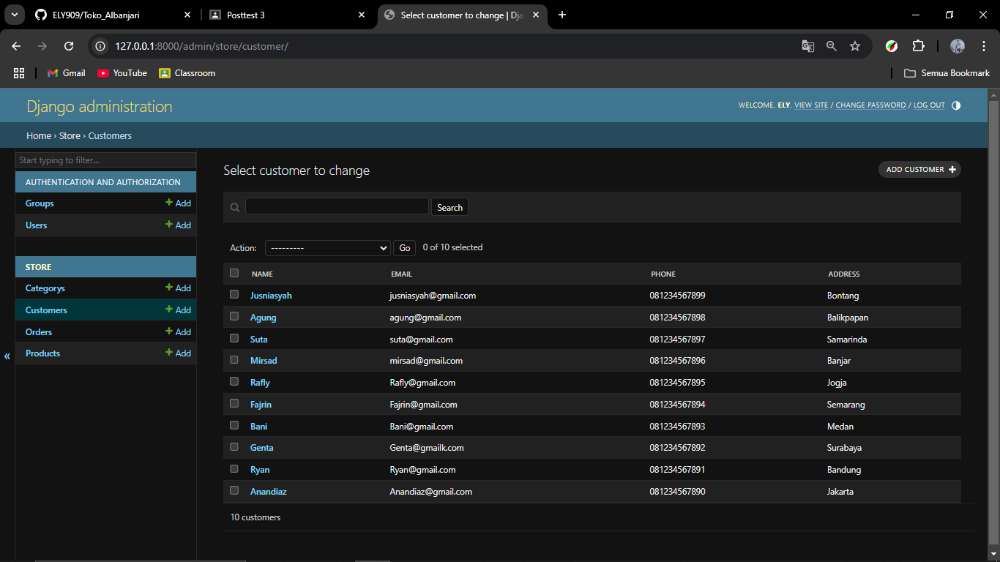
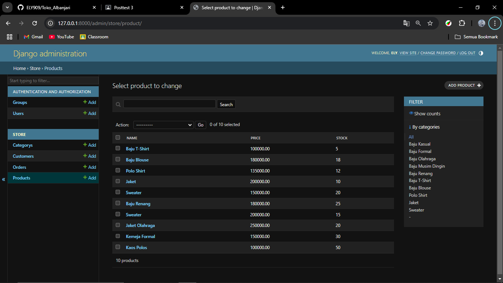

## POSSTEST 1
**Nama:** Muhammad Arif Rachman  
**NIM:** 2209106009

## Tampilan Website

## POSSTEST 2
## Struktur

## Seed Database

## POSSTEST 3
## Aksi
Setiap kali admin melakukan penambahan atau pengeditan data Customer di panel admin, ada proses otomatis yang berlangsung setelah data disimpan. Saat data Customer baru ditambahkan, sistem akan memeriksa apakah customer tersebut sudah memiliki Order sebelumnya. Jika customer tersebut belum memiliki pesanan sama sekali, sistem akan secara otomatis membuat satu Order baru untuk mereka.

Proses ini berjalan dengan sendirinya, sehingga admin tidak perlu menambahkan pesanan secara manual setiap kali ada customer baru. Jika customer yang disimpan adalah customer yang sudah ada (misalnya diperbarui), sistem tidak akan membuat Order baru lagi, karena pelanggan tersebut mungkin sudah memiliki pesanan sebelumnya.

## Tabel Django

